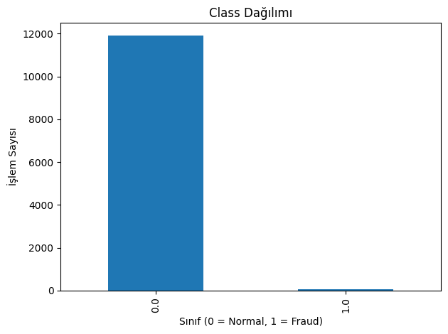
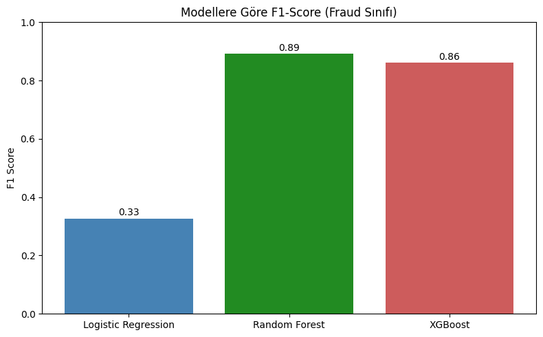
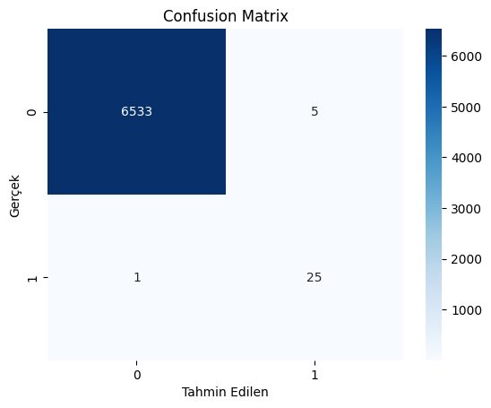

# 💳 Credit Card Fraud Detection

Bu proje, Akbank tarafından düzenlenen Makine Öğrenmesine Giriş Bootcamp’i kapsamında gerçekleştirilmiştir.
Amaç, kredi kartı işlemlerinde gerçekleşen sahtekarlıkların tespiti için farklı makine öğrenmesi algoritmalarını karşılaştırmak ve en uygun modeli belirlemektir.

---

## 📌 Proje Özeti

- **Problem Türü:** Binary classification (fraud vs. non-fraud)
- **Kullanılan Veri Seti:** [Credit Card Fraud Detection - Kaggle](https://www.kaggle.com/datasets/mlg-ulb/creditcardfraud)
- **Veri Özelliği:** Zaman ve tutar dışında tüm özellikler PCA ile anonimleştirilmiş, 31 sütunlu, dengesiz sınıf yapısına sahip.

---

## 🔎 Veri ve Sınıf Dağılımı
Veri setinde sahte işlemler, toplam işlemlerin yalnızca çok küçük bir kısmını oluşturur (çok dengesiz sınıf dağılımı). Bu durum, klasik modellerin sahtekarlıkları tespit etmesini zorlaştırır. Bu nedenle, sadece eğitim setine SMOTE uygulanarak azınlık sınıf yapay olarak dengelenmiş ve modeller bu veriyle eğitilmiştir. Test seti gerçek dağılımı koruyarak modelin gerçek performansı ölçülmüştür.



---

## ⚙️ Kullanılan Yöntemler ve Süreçler
📐 Veri Ön İşleme:
- Eksik değer kontrolü ve temizliği
- Özellik ölçeklendirme (StandardScaler)
- Eğitim ve test setlerine bölme

⚖️ Dengesizlik Problemi:
- Sadece eğitim setine SMOTE uygulanarak azınlık sınıf dengeledi
- Test seti orijinal haliyle bırakıldı

🧠 Denenen Modeller:
- Logistic Regression
- Random Forest ✅
- XGBoost

🔍 Model Seçimi:
- Modeller hem çapraz doğrulama hem de test seti üzerinde karşılaştırıldı.
- En iyi performansı gösteren model: Random Forest
---

## 📊 Test Seti Performans Karşılaştırması

| Model               | Precision (Fraud) | Recall (Fraud) | F1-score (Fraud) | Accuracy |
|---------------------|------------------|----------------|------------------|----------|
| Logistic Regression | 0.20             | 1.00           | 0.33             | 0.98     |
| Random Forest ✅      | 0.83             | 0.96           | 0.89             | 1.00     |
| XGBoost             | 0.78             | 0.96           | 0.86             | 1.00     |

### 🎯 Yorum:
- Logistic Regression sahtekarlıkları kaçırmıyor (recall 1.00) ama çok fazla yanlış pozitif üretiyor.
- Random Forest dengeli precision ve recall ile öne çıkıyor.
- XGBoost yüksek performans gösterse de precision'da biraz daha zayıf.

---

## 📈 F1 Score Karşılaştırması

Her modelin fraud sınıfı için F1-score performansı:



---

## 🔍 Confusion Matrix – Random Forest

Modelin sahte ve gerçek işlemleri nasıl sınıflandırdığını aşağıdaki matrix göstermektedir:



---

## ✅ Neden Random Forest?

- En yüksek F1 skoru (%89)
- Dengeli precision ve recall oranı
- Overfitting’e karşı dayanıklı
- Yorumlanabilir ve kolay optimize edilebilir

---

🛠️ Projenin Gerçek Hayattaki Kullanımı
Bu model, finans kurumlarında işlem anında kredi kartı işlemlerini analiz ederek potansiyel sahtekarlıkları tespit eder. Böylece gereksiz iptaller veya yanlış alarmlar azaltılırken gerçek dolandırıcılıklar hızlıca engellenebilir. Özellikle yüksek hacimli finansal işlemlerde manuel kontrolün imkânsız olduğu durumlarda otomatik ve güvenilir bir fraud tespit sistemi iş süreçlerini ve müşteri memnuniyetini ciddi şekilde artırabilir.


---


## 🔗 Bağlantılar

- 📘 [Kaggle Notebook](https://www.kaggle.com/code/serayustun/credit-card-fraud)  

---

## 🛠️ Kullanılan Kütüphaneler

- `pandas`, `numpy`
- `scikit-learn`
- `imbalanced-learn`
- `xgboost`
- `matplotlib`, `seaborn`

---
🔮 Geliştirme Önerileri
- Model deployment: Model bir API olarak canlı sistemlere entegre edilip gerçek zamanlı tahminler yapılabilir.
- Gerçek veri takibi: Modelin zamanla performansını izleyip güncelleme mekanizması kurulabilir.

---
## 💻 Çalıştırmak için

```bash
pip install -r requirements.txt
